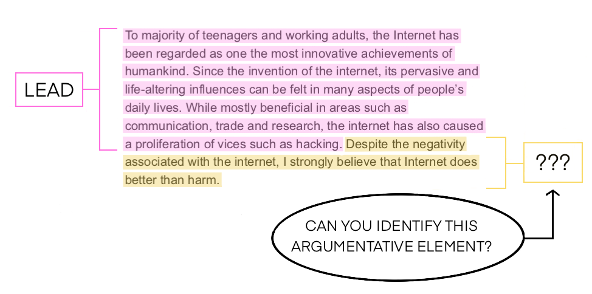

# Feedback Prize

## Intro
&emsp;&emsp;Writing is a critical skill for success. However, less than a third of high school seniors are proficient writers, according to the National Assessment of Educational Progress. Unfortunately, low-income, Black, and Hispanic students fare even worse, with less than 15 percent demonstrating writing proficiency. One way to help students improve their writing is via automated feedback tools, which evaluate student writing and provide personalized feedback.
&emsp;&emsp;In this competition, you’ll identify elements in student writing. More specifically, you will automatically segment texts and classify argumentative and rhetorical elements in essays written by 6th-12th grade students. You'll have access to the largest dataset of student writing ever released in order to test your skills in natural language processing, a fast-growing area of data science.

## Baseline
### 1. Bigbird
&emsp;&emsp;超参：
* epochs=5
* bs=24 (3 * gradient_accumulation_steps=8)
* max_length=1024
* lr=1e-5/2 * gradient_accumulation_steps=8 = 4e-5
* warmup_steps=500
* weight_decay=1e-2
* AdamW epsilon=1e-6